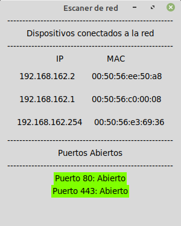

# Network-Scanner
 
#### Escaner de red ARP y puertos hecho en Python con Scapy
##### Librerias: Scapy y Tkinter
### Documentación
- [Scapy](https://scapy.readthedocs.io/en/latest/usage.html)
- [Tkinter](https://docs.python.org/3/library/tk.html)
- [Socket](https://docs.python.org/3/library/socket.html)
